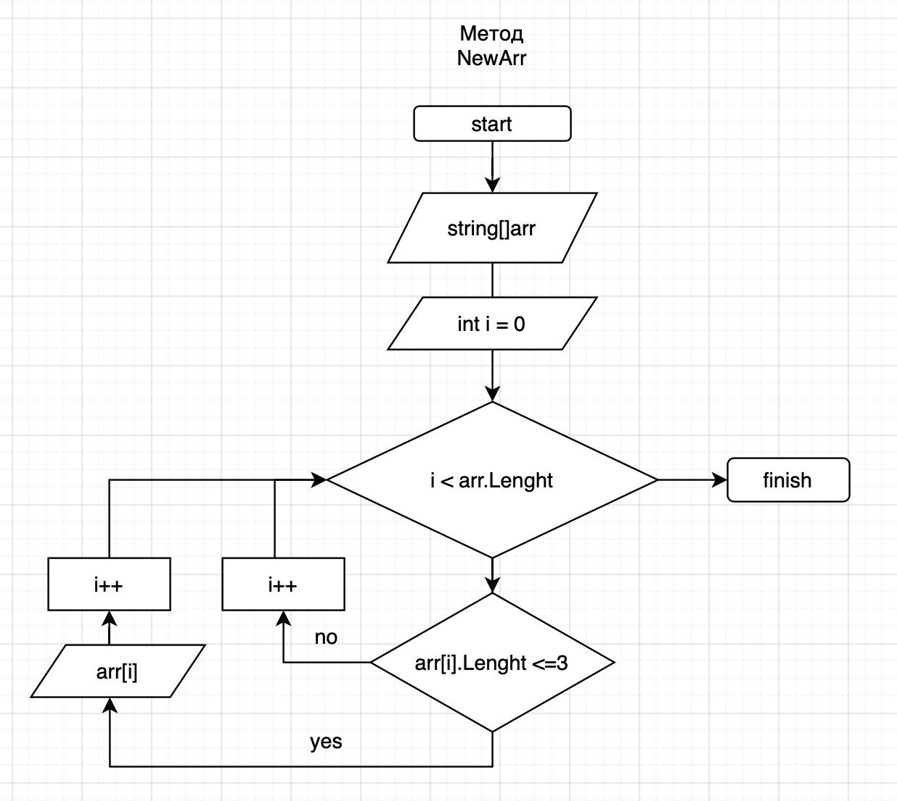

1) задаем массив на входе
2) создаем метод, который на основе существующего массива выводит пользователю новый массив с элементами, в котором колличество символов не привышает 3

3) создаем второй метод для вывода массива на экран
4) вызываем полученные методы